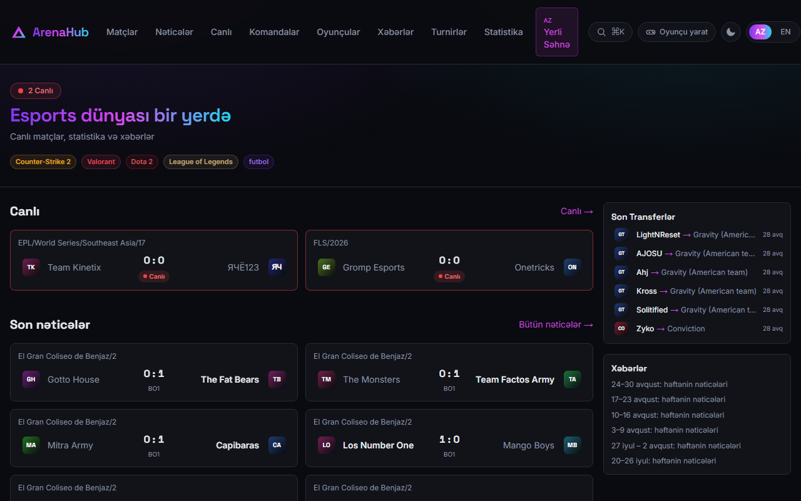
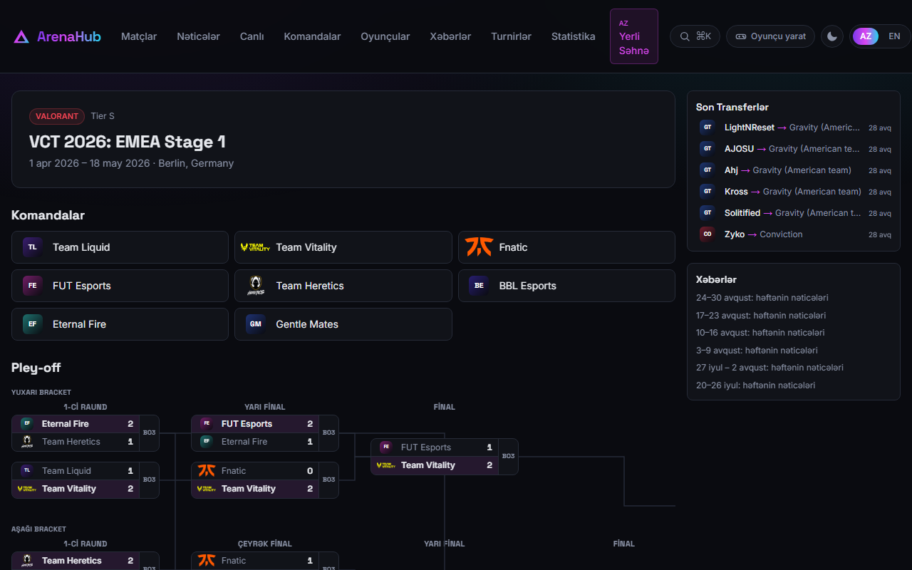

# ArenaHub

[](https://github.com/EmilTahirov24/arenahub/actions/workflows/ci.yml)
[](LICENSE)
[](https://arenahub-wheat.vercel.app)

### 🔗 Live site — **[arenahub-wheat.vercel.app](https://arenahub-wheat.vercel.app)**

Esports results and statistics in **Azerbaijani and English**, covering CS2, Dota 2,
VALORANT and League of Legends. Fixtures and live scores, playoff brackets drawn from
recorded results, team and player pages, tournament prize breakdowns, and an Elo
ranking recomputed from match history.

> 🇦🇿 **Azərbaycanca:** [README.az.md](README.az.md)



---

## Why it exists

There is almost no esports coverage in Azerbaijani. Beyond the language barrier there
is a practical one: HLTV, the largest Counter-Strike source, is **not reachable from
where I live** — the domain resolves, but the connection never completes, while
Liquipedia answers in under a third of a second from the same machine. The data
existed and was simply out of reach.

ArenaHub closes that gap, in both languages, from sources that are legally usable.

| | |
|---|---|
| **Matches** | 3,265 |
| **Teams** | 960 |
| **Players** | 1,392 |
| **Tournaments** | 180 |
| **Indexed URLs** | 6,100 |
| **Games** | CS2 · Dota 2 · VALORANT · League of Legends |
| **Languages** | Azerbaijani · English |

<sub>Measured from the live site, September 2026. The importer runs on a schedule, so these grow daily.</sub>

---

## Running it

```bash
docker compose up
```

That is the whole setup: it starts PostgreSQL, applies the migrations, seeds the
database and serves the site on <http://localhost:3000>.

The first start takes a few minutes, and the reason is worth stating: `next build`
prerenders pages that read from the database, so it cannot run while the image is
being built — there is no database then. The container therefore migrates, seeds and
builds on start, once Postgres reports healthy.

> **Status:** [CI](.github/workflows/ci.yml) runs this command on every push so the
> claim is checked rather than asserted. The type/lint/unit job is green; the compose
> job is not passing yet, and this line will say so until it does.

<details>
<summary>Without Docker</summary>

```bash
npm install                 # postinstall runs `prisma generate`
cp .env.example .env        # then fill it in — see README.az.md for the full table
npx prisma migrate deploy
npx prisma db seed
npm run dev
```

</details>

---

## Architecture

```
Liquipedia API ──▶ 8 import scripts ──▶ PostgreSQL ──▶ Next.js ──▶ Vercel
  CC BY-SA,          matches, teams,      19 models,     server-      CDN,
  2.6 s between      rosters, logos,      13 migrations  rendered     automatic
  requests           tournaments                         + cached     migrations
```

Nothing is written by hand into the pipeline. Team ratings are **not stored as input**:
they are replayed from the full match history every time a result changes, because Elo
depends on order — correcting an old result incrementally would leave the error in
place permanently ([lib/elo.ts](lib/elo.ts), [lib/rating.ts](lib/rating.ts)).

Playoff brackets are reconstructed from results rather than from position. A line is
drawn between two matches only when the data confirms it: the last match a team
**won** before arriving. Where the reconstruction fails its own consistency check, no
bracket is drawn at all ([components/events/Bracket.tsx](components/events/Bracket.tsx),
[lib/stages.ts](lib/stages.ts)).



---

## Testing

| | |
|---|---|
| **Unit tests** | 79 checks in Vitest, under a second — Elo maths, round vocabulary, prize ranges, timezone handling, WCAG contrast, URL safety |
| **End-to-end** | 157 checks in real Chromium via Playwright, across 6 suites |
| **Accessibility** | axe-core — 0 contrast violations in both themes |
| **Dependencies** | `npm audit` — 0 vulnerabilities |

```bash
npm run test    # unit
npm run e2e     # browser suites (requires `npm run dev` in another terminal)
```

The e2e suites drive a real browser: they create a tournament, add teams, enter live
map scores, watch the match walk from `UPCOMING` to `LIVE` to `FINISHED`, and confirm
the rating recomputes — then check the public pages in both languages. Console errors
and 4xx/5xx responses are collected automatically, so a page that renders while
something breaks behind it still fails the run.

**Unit tests are not written to raise a number.** Each one pins either a real bug that
shipped or a boundary that matters. The three bugs below each have tests named after
them.

Two dependencies are pinned forward through `overrides` rather than left to npm. In
both cases npm's own `audit fix` proposes downgrading Prisma by a major version — a
breaking change, offered to remove a vulnerability in a MySQL driver this project never
loads, because it runs on PostgreSQL. Forcing the patched package forward is the smaller
change, and it is written down rather than left as a silent pin.

---

## Engineering decisions

### "No error" is not the same as "correct"

The three worst bugs in this project all ran without throwing anything.

**Timezone.** Date formatting ran in the server's zone. The server is on Vercel, where
that zone is UTC — so a match starting at 13:00 in Baku was published as 09:00. Four
hours early, for every visitor, with nothing in the logs. Fixed by routing every date
through one formatter pinned to the site's zone ([lib/dates.ts](lib/dates.ts)), and by
printing "Baku time" on screen so the number cannot be read as local.

**A duplicate that fed itself.** Name normalisation classified two identically named
teams as ambiguous and dropped them from the lookup. The importer, unable to find the
team, then created a new one — every pass. One organisation had grown to **42 rows**.
The bug was its own cause ([lib/orgNames.ts](lib/orgNames.ts)).

**Colour contrast.** In light mode every game badge sat below the WCAG threshold — one
measured **1.90:1** against a required 4.5:1. The automated checker never reported it,
because axe skips elements on gradient backgrounds. It had to be measured by hand, then
replaced with a computed colour that lightens or darkens until it passes
([lib/contrast.ts](lib/contrast.ts)).

### Data integrity

**Nothing is invented.** Every figure either comes from the source or is computed from
matches already recorded. Where the source holds nothing, the page says so — player
statistics are empty in production because Liquipedia publishes match scores, not
per-player kill counts, and the page states this rather than showing zeros. A blank
column reads as missing data; a filled one reads as a fact.

**HLTV is not used.** It has no public API, and every "HLTV API" package on npm is a
scraper that works against their terms. Liquipedia is used instead, credited in the
footer under CC BY-SA — a condition of the licence, not a courtesy — with 2.6 seconds
between requests because their terms ask for it.

**Player photographs are licensed.** They come from Wikimedia Commons under CC BY,
CC BY-SA or CC0 only. The photographer is named on the player's page and every photo is
listed on a [credits page](https://arenahub-wheat.vercel.app/az/credits). Liquipedia's
own photographs are deliberately **not** used: no licence is published for them, and
their notice makes clear that permission was granted to them, not onward. Team logos are
different — trademarks used nominatively to identify the team.

**A guessed round is an invented claim.** If bracket reconstruction cannot verify
itself — each round must be smaller than the last, and at least one winner must appear
in the next — the matches keep their result and lose their round. Empty beats wrong.

---

## Project layout

```
app/[locale]/     public pages (matches, teams, players, events, news…)
app/admin/        admin panel — all content management
app/player/       player accounts: registration, profile, team, roster
lib/              auth, business rules, parsing, formatting, sanitisation
components/       UI, grouped by feature
prisma/           schema, hand-written SQL migrations, seed
scripts/          import and maintenance scripts
e2e/              browser suites
tests/            unit tests
```

Some in-code comments are in Azerbaijani, since the project's audience is. The
reasoning behind each decision is written next to the code that implements it — the
files linked from this README are in English.

---

## Licence

[MIT](LICENSE) © 2026 Emil Tahirov

Match data from [Liquipedia](https://liquipedia.net) under
[CC BY-SA 3.0](https://creativecommons.org/licenses/by-sa/3.0/).
Player photographs from Wikimedia Commons under their individual free licences, credited
in full on the site.
